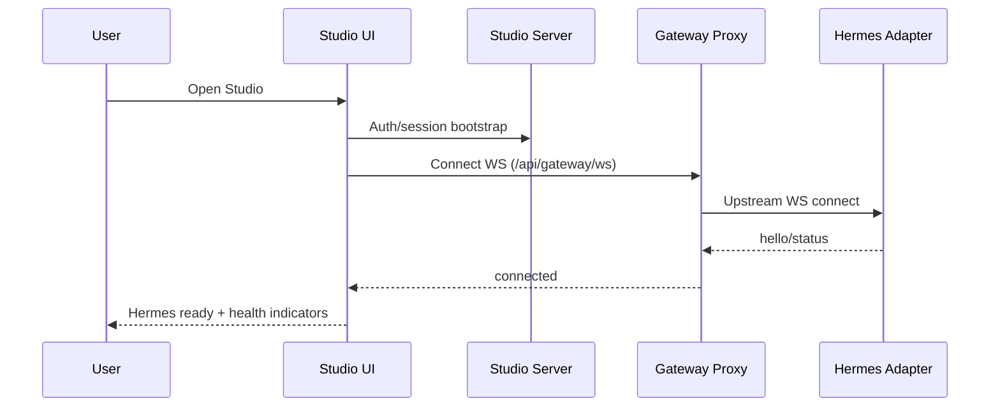

# Architecture: Agent Team Maturity Sprint (2 semanas)

Status: **APPROVED**
Author: Hermes Architect
Date: 2026-05-24
Spec: [spec.md](spec.md)
Clarifications: n/a

## Approach

Aplicar melhorias incrementais em três eixos: (1) acesso e onboarding sem fricção, (2) conectividade resiliente com mensagens acionáveis, (3) guardrails de estado/config para evitar regressões de backend. A implementação preserva a arquitetura atual (Studio + gateway proxy + Hermes adapter), com mudanças pontuais em UI/estado e políticas de runtime.

## Components

### Data layer
- Sem novo banco.
- Persistência local já existente (settings/localStorage) com migração defensiva de estado legado.

### Backend
- Ajustes no fluxo de autenticação de acesso ao Studio (sem exigir console manual).
- Guardrails para backend padrão (Hermes em produção).
- Exposição de sinais de saúde para UI operacional.

### Frontend
- Tela de conexão com mensagens de erro acionáveis.
- Auto-reconnect com backoff controlado.
- Normalização de estado salvo incompatível.
- Painel leve de health/status.

### Integration
- Manter integração atual com Hermes adapter via WS (`127.0.0.1:18789`).
- Manter rota de acesso privada via Tailscale e políticas de firewall.

## Data flow

## APIs / contracts

- Manter contrato WS atual de connect/status/chat.
- Padronizar erro exibido ao usuário em categorias:
  - `auth_required`
  - `upstream_unreachable`
  - `upstream_blocked`
  - `network_timeout`
  - `backend_mismatch`
- Cada categoria deve incluir `next_action` textual na UI.

## Storage

- Fonte principal: settings existentes do Studio.
- Regra de migração:
  - se estado legado estiver inconsistente, forçar perfil Hermes em produção.
  - preservar preferências válidas do usuário (ex.: render mode) sem contaminar backend/runtime.

## Dependencies

- Sem dependências externas novas obrigatórias.
- Reuso de systemd, Tailscale, e componentes existentes de Claw3D.

## Trade-offs considered

- Opção A: remover completamente camada de token de Studio — descartada por reduzir defesa em profundidade.
- Opção B (escolhida): manter segurança, mas eliminar fricção com fluxo de acesso amigável e persistente.
- Opção C: reescrever gateway flow — descartada por custo e risco para sprint curta.

## Open questions

- Política final de expiração de sessão Studio (prazo ideal).
- Nível de detalhe do painel de health sem poluir UX.
- Estratégia de feature flag para demo em ambientes híbridos.

---

*Próximo passo: execução por camadas conforme tasks.md.*
